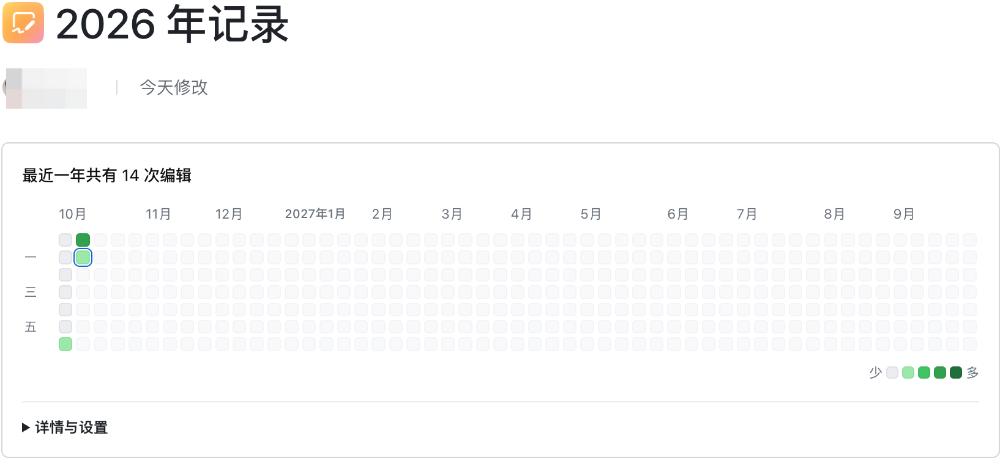
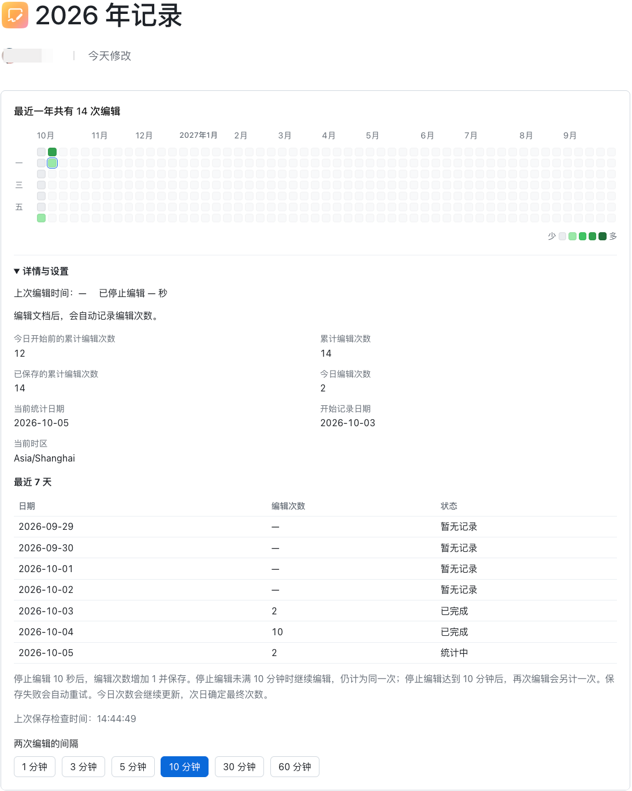

# 飞书云文档日历热力图

一个嵌入飞书文档正文的小组件，用 GitHub 贡献日历的形式展示每天的编辑活跃度。适合在同一篇文档里长期写日记、做记录，让持续写作留下看得见的痕迹。



## 为什么做这个项目

我习惯在同一篇飞书文档里写日记，也想用编程 Agent 做一些对自己有用的小工具。浏览 GitHub 个人主页时，贡献日历给了我一个想法：能不能在飞书日记里也放一张热力图，看看自己每天写日记的活跃度？

开发前，我简单搜索了一下，没有找到符合这个需求的工具，于是决定自己做一个飞书文档小组件。对我来说，它的意义很直接：让日常记录有一个直观的反馈，也把自己的需求变成一个可以使用的作品。

## 有哪些特点

- **跨设备使用**：在支持文档小组件的飞书网页端和各类客户端中使用；图表随可用宽度调整，窄屏可以横向滚动。
- **数据保存在飞书**：编辑统计和设置通过飞书官方存储接口保存在飞书服务器中，无需自建数据服务。换设备打开同一个小组件，可以读取已保存的记录。
- **简洁美观**：沿用 GitHub 贡献日历的方格布局和绿色层次，主要展示热力图，将统计详情与设置收进折叠面板。
- **自动记录，可回看历史**：编辑后自动计数、保存，每页展示 53 周；记录超过一页后，可以翻页查看更早的日期。

## 如何使用

安装或添加已发布的小组件后，在有编辑权限的飞书文档正文中，通过「+」或「/」插入小组件，随后正常编辑文档即可。自行构建、上传和发布的方法见 [开发与实现说明](doc/development-guide.md#配置与开发)。

展开「详情与设置」，可以查看今日与累计编辑次数、保存状态、最近 7 天记录，并设置「两次编辑的间隔」。可选 1、3、5、10、30、60 分钟，默认 1 分钟；设置保存成功后，其他设备打开或刷新同一个小组件时会读取它。



## 贡献如何计算

这里的「贡献」指一次编辑会话，界面显示为「编辑次数」。它衡量编辑的频次，不按输入字数、修改块数或编辑时长计分。

### 一次编辑，只计一次贡献

1. 检测到文档内容的新增、删除或修改，开始一次编辑会话。
2. 最后一次编辑后空闲 **10 秒**，贡献次数加 1，并提前保存；此时会话仍未结束。
3. 在设定的编辑间隔内继续编辑，仍属于同一次贡献，并从最后一次编辑重新计时。只有连续空闲达到设定时长，这次会话才结束；之后再编辑，才会另计一次。

例如，将间隔设为 1 分钟：写完一段后停下 10 秒，记 1 次；停下 30 秒又继续写，仍是这一次。等到最后一次编辑后连续空闲满 1 分钟，再开始写，才进入下一次贡献。后续保存和会话结束都不会重复加次数。

### 当天实时累计，次日结算

当天贡献会随计数更新，并持续保存。次日小组件运行或再次打开时，将前一天的次数结算为历史记录；跨日时尚未结束的会话会先处理完。日期按当前设备的本地时区划分。

今天的方格也会随贡献次数变色，蓝色轮廓表示当天仍在统计。**未结算不等于未保存**，当天成功保存的贡献在重新打开后仍可恢复。

### 颜色表示相对活跃程度

小组件从已结算的历史中，取出贡献大于 0 的日期，按每天的贡献次数计算 25%、50%、75% 三个分档阈值，划分为由浅到深的 4 档绿色。0 次贡献显示为灰色。

颜色反映的是某一天相对于这份文档自身历史记录的活跃程度：贡献越多，颜色越深。阈值随历史动态变化，因此同样的次数在不同阶段可能显示不同深浅。尚无活跃日历史时，有贡献的日期先显示最浅绿色；历史次数集中时，也不一定会用到全部 4 档颜色。

```text
文档内容变化 → 开始或延续编辑会话
                    ↓
           首次空闲 10 秒：贡献 +1，提前保存
                    ↓
           连续空闲达到设定时长：会话结束
                    ↓
           当天实时累计 → 次日结算为历史
                    ↓
           历史活跃日的 25% / 50% / 75% 阈值
                    ↓
           0 次为灰色，有贡献为 4 档绿色
```

### 统计范围

- 从启用小组件开始记录，仅统计小组件运行且成功监听到的文档变化，无法补算启用前或未运行期间的编辑。
- 打开、刷新或无编辑的闲置不增加贡献；实现会过滤加载期间的静默变更。
- 首次空闲未满 10 秒就关闭页面，这次编辑不会计入贡献；关闭前尚未成功保存的数据也无法保证恢复。
- 当前按文档变化统计，不区分编辑者身份。用于个人日记时可以反映自己的记录活跃度；多人协作或多个实例同时运行时，事件重复与存储冲突仍需验证。

## 开发与技术文档

项目使用 JavaScript、webpack 和飞书官方小组件 SDK。本地开发从 `app.example.json` 创建 `app.json`，填写应用、组件和调试文档信息，并保持 `useInteraction: true`。

```bash
npm ci
npm run start:preview  # 预览外观，不读取飞书数据
npm start             # 飞书文档内调试
npm test              # 自动化测试
npm run build         # 构建程序包
```

- [开发与实现说明](doc/development-guide.md)：原 README 的技术内容，包括项目结构、配置、上传发布和官方接口。
- [开发验证说明](doc/development-verification.md)：完整计数规则、数据结构与验收步骤。
- [文档静默变更与贡献误计修复](doc/document-change-silence.md)：加载事件过滤的依据与验证边界。
