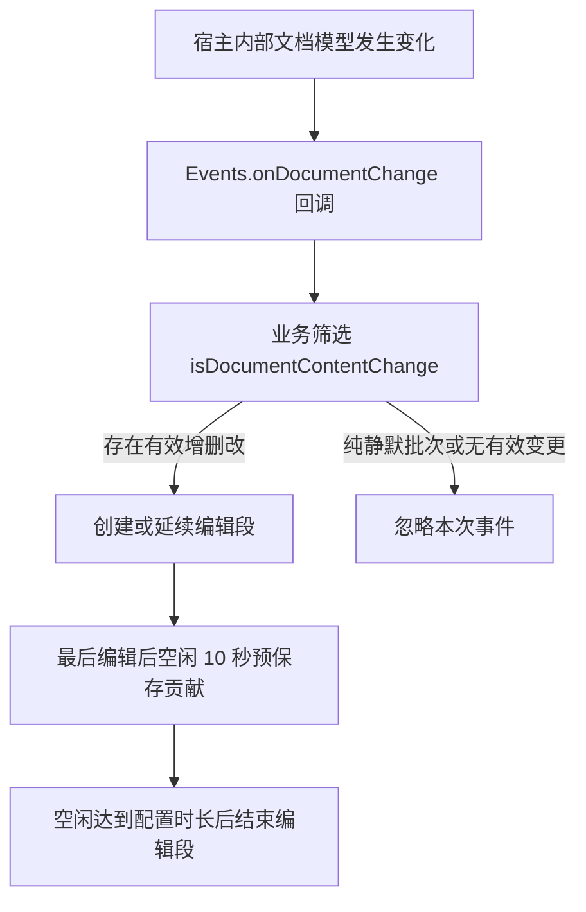

# 文档静默变更与贡献误计修复

本文面向项目维护者，说明网页端打开、刷新文档时贡献误计的原因、事件传递机制，以及本次过滤修复的依据和边界。修复排除 `from: "silence"` 的变更条目，保留其他有效增删改；既有贡献计时和存储结构不变。

## 现象与网页端实测

问题表现为：没有编辑文档正文，只刷新页面，小组件也进入编辑状态，并在空闲 10 秒后增加一次贡献。

修复前通过已登录的 Chrome 打开、刷新同一文档，并使用开发者工具在业务判断处记录事件。测试没有编辑文档正文。业务代码实际收到了以下形式的数据：

```json
{
  "changes": [
    { "type": "update", "blockId": 976, "from": "silence" },
    { "type": "update", "blockId": 977, "from": "silence" },
    { "type": "update", "blockId": 978, "from": "silence" }
  ]
}
```

多次打开、刷新中，既有未收到新事件的情况，也有收到成批 `silence` 更新的情况。新标签页首次进入文档也曾收到这类更新。因此，这不是一个只会在刷新时出现的事件，不能以「新标签页」或「刷新」作为贡献判断条件。

宿主模型回填与小组件订阅的先后顺序，可以解释为什么并非每次进入页面都观察到事件；具体的缓存和调度条件未被完整验证，不能作为确定根因。已经确认的误计链路是：加载期间的静默更新进入了业务判断，而旧判断只检查变更类型。

## 事件如何进入贡献统计

项目通过 `connectFeishu().listen(handler)` 调用 `DocMiniApp.Events.onDocumentChange(doc, handler)`。适配层直接传递业务回调，不转换事件内容，也不删除 `from`。业务回调将完整事件交给 `idle.activity(event)`。



开发者工具中观察到的飞书宿主实现会订阅内部记录变化，把相应操作转换为 `insert`、`remove`、`update`，并将事务的 `options.from` 复制到每条变更的 `from` 字段。该层没有先排除 `silence`。

文档引擎存在占位记录回填路径：已加载的真实记录替换占位记录时，`replacePending` 可以执行标记为 `SILENCE` 的内部事务。这会改变客户端模型，并进入文档变化回调；它不要求用户做一次新的正文编辑。客户端模型变化因此不能直接等同于用户编辑贡献。

旧 `isDocumentContentChange` 只要发现任意一条 `insert`、`remove` 或 `update` 就返回 `true`。加载产生的 `update` 由此启动或延续编辑段：无已有编辑段时可产生一次误计，已有编辑段时则可能更新最后编辑时间、推迟预保存或结束。

## `silence` 的含义与证据边界

本文中的「静默变更」指 `event.changes` 中 `from === "silence"` 的条目。`silence` 是来源标记，变更类型仍然是 `insert`、`remove` 或 `update`；它不是本文确认过的官方独立事件类型。

| 证据来源 | 可以确认的内容 | 不能据此推断的内容 |
| --- | --- | --- |
| 官方公开 API 文档 | `Events.onDocumentChange` 监听文档内容变化，回调包含 `changes` | 文档没有公开说明 `from` 或 `silence` 的语义与稳定性保证 |
| 项目 SDK `@lark-opdev/block-docs-addon-api@0.0.11` 的类型定义 | `BlockChange` 定义了三种增删改类型 | 类型没有声明 `from`，不能据此保证所有宿主版本都会返回它 |
| 修复前网页实测 | 业务回调收到了加载期间的 `update`，来源为 `silence` | 未实测正常增删改、撤销重做等全部编辑路径的来源值 |
| 当时的飞书宿主实现 | 来源标记会转发到回调，占位记录回填可以使用 `SILENCE` 事务 | 不能断言所有 `silence` 都只用于加载，也不能视为公开接口契约 |

本次过滤依据当前运行时证据。没有将「静默变更」定义为所有未改变正文的事件，也没有把所有非静默事件证明为用户编辑。若宿主以后不再提供 `from`，缺失来源会按原增删改规则处理，加载误计可能重新出现；届时需重新收集实际回调并核对宿主行为。

来源参考：

- [官方 Events.onDocumentChange 文档](https://open.feishu.cn/document/client-docs/docs-add-on/05-api-doc/events/Events.onDocumentChange)
- [本项目 SDK 类型定义](../node_modules/@lark-opdev/block-docs-addon-api/dist/types/index.d.ts)
- [观察到的宿主事件适配实现](https://lf-package-cn.feishucdn.com/obj/feishu-static/eesz/bear/docx/module/module_infra_doc-mini-app-manager_es6.975bac24.chunk.js)
- [观察到的宿主文档引擎实现](https://lf-package-cn.feishucdn.com/obj/feishu-static/eesz/bear/docx/module/ee/docs/docx/1.0.18.206/index_merged_es6.js)

宿主源码链接对应当时观察到的资源版本，升级后可能变更。

## 修复规则与兼容性

修改集中在 `src/idle.mjs` 的 `isDocumentContentChange`：逐条检查变更类型和来源，只要存在一条非静默的有效增删改，整个事件就作为编辑活动处理。

| 批次内容 | 是否作为编辑活动 | 计时行为 |
| --- | --- | --- |
| 只有 `from: "silence"` 的增删改 | 否 | 不创建或延续编辑段，不更新最后编辑时间 |
| `local` 或 `remote` 来源的有效增删改 | 是 | 沿用原计时与预保存规则 |
| 缺失来源或其他来源值的有效增删改 | 是 | 保留原增删改判断，避免来源白名单漏计 |
| 静默条目与其他有效增删改混合 | 是 | 按一次编辑活动处理，不按条目数量计贡献 |
| 空批次、无效条目或只有其他类型 | 否 | 不启动计时 |

过滤发生在 `activity` 更新编辑段之前，因此纯静默批次也不会触发业务回调中的编辑状态更新、`onActivity` 或新的保存操作。已有编辑段的定时器继续运行；由原编辑触发的预保存和结束仍会正常执行，不能将这些既定操作误认为静默事件新增了贡献。

本次没有修改 API 订阅、公开函数签名、SDK 版本、Interaction 数据结构或贡献分段规则。没有引入加载后等待若干秒的窗口，正常编辑从监听成功后即可进入原计时流程。保留 `remote` 是为了延续当前文档贡献口径，来源字段不用于识别编辑者身份。

已有误计不会自动扣除。历史存储仅记录贡献统计和未结束编辑段，没有保留足以判断误计的事件来源，无法可靠地区分历史真实贡献与加载误计。

## 自动化验证与真实宿主验收

本次自动化测试使用模拟事件、模拟时钟和项目现有存储集成工具，验证业务筛选之后的行为。它不能替代飞书宿主实际如何产生事件的验证。

新增回归覆盖：

- 纯静默的三种增删改、连续多批加载事件均不启动编辑段或贡献保存。
- 三种增删改在 `local`、`remote`、缺失和其他来源下仍能在空闲 10 秒后预保存。
- 混合批次保留有效编辑，静默条目位于批次前后都不影响判断。
- 静默事件不改变原定预保存和结束时间，也不更新最后编辑时间。
- 事件到存储的链路中，静默加载不改统计；正常编辑仍只计一次。
- 恢复已有编辑段后，静默加载不延长计时或增加贡献。

| 验证项 | 本次结果 |
| --- | --- |
| `npm test` | 通过：88 项测试全部通过，本次新增 17 项回归测试，并扩展已有无效事件测试 |
| `npm run build` | 通过：webpack 正式构建成功，生成 `dist/` 程序包 |
| 修复前网页端事件来源 | 已观察到加载期间的 `update` / `silence` 回调 |
| 修复后真实宿主打开、刷新 | 待验证，本次未上传或发布修复版本 |
| 修复后真实宿主增删改及其他编辑路径 | 待验证，本次没有编辑原测试文档 |

使用包含本次修复的小组件版本，按以下步骤进行真实宿主验收。正常编辑步骤使用可编辑的验收文档，由人工执行。

1. 记录累计贡献和已保存贡献，确认没有未结束编辑段。在新标签页打开文档，不编辑，等待超过 10 秒并覆盖当前配置的分段时长。检查两个计数均不增加，闲置秒数保持「—」。
2. 刷新文档并重复检查。打开或刷新不一定每次都产生静默事件；若需要确认过滤路径，结合开发者工具记录实际 `changes`，以收到纯 `silence` 批次后仍无新增贡献为依据。
3. 分别执行插入块、删除块、修改块内容。每项都等待上一编辑段结束后再开始，检查操作进入编辑状态，空闲 10 秒后累计贡献增加 1，随后结束时不重复增加。
4. 预保存后刷新，在原编辑段尚未结束时恢复页面。检查加载不重置最后编辑时间，累计不重复增加，并在原编辑时间对应的结束边界完成该段。加载耗时跨过边界时，恢复后应直接结束原段。
5. 按实际使用路径检查粘贴、撤销重做和协作端编辑，记录事件的 `type`、`from` 与计数结果。若真实编辑被标记为 `silence`，需要重新评估过滤规则，不能将本地模拟测试当作兼容性证明。

验收时已有贡献的确认、跨日结算或待保存状态落盘可能更新存储；判断是否误计，应比较累计贡献是否新增，以及最后编辑时间是否被加载事件改写。

本次验证结论限定为：已观察到的静默加载事件被业务筛选排除，其他来源的有效事件保持现有行为；全部真实编辑路径的兼容性仍待宿主验收。
